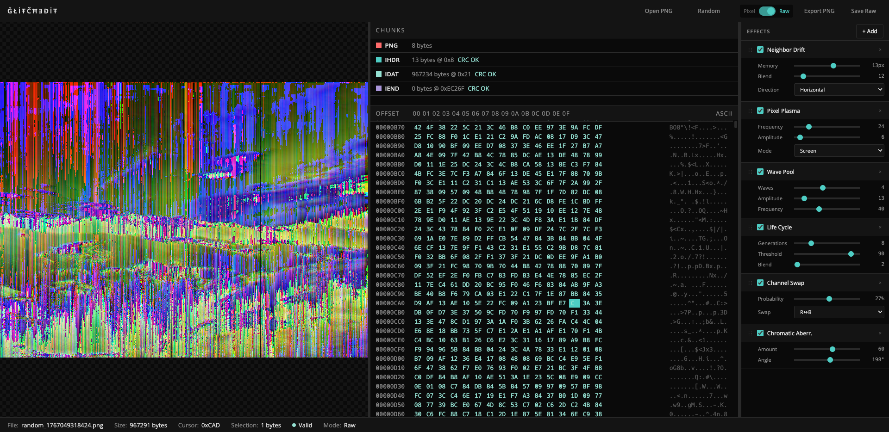

# GĻƗŦÇĦɆĐƗŦ

[](https://opensource.org/licenses/MIT)
[](https://helgesverre.github.io/glitchedit/)

A browser-based PNG glitch art editor with 48 real-time effects and direct byte manipulation.

**[Try it live](https://helgesverre.github.io/glitchedit/)**



## Features

- **48 Glitch Effects** - Channel shifts, pixel sorting, data moshing, cellular automata, and more
- **Hex Editor** - Edit PNG bytes directly with real-time preview
- **Layer System** - Stack multiple effects with adjustable parameters
- **Chunk Navigator** - Visual breakdown of PNG structure (IHDR, IDAT, IEND, etc.)
- **CRC Auto-fix** - Automatically recalculates checksums on save

## Quick Start

```bash
# Clone and run
git clone https://github.com/helgesverre/glitchedit.git
cd glitchedit
npx serve .
```

Then open http://localhost:3000 in your browser.

### Alternative: Single-file build

```bash
# Build standalone HTML file (includes all effects)
bun run build:bundle

# Open dist/glitchedit.html in your browser
```

## Development

```bash
# Install dependencies
npm install

# Run dev server
npm start

# Run tests
npm test

# Generate effect previews (for help dialog)
npm run generate-previews

# Build single-file distribution
npm run build:bundle
```

## Usage

1. Open the app - a random image loads automatically
2. Click **+ Add** to apply glitch effects
3. Adjust effect parameters with sliders
4. Stack multiple effects by adding more layers
5. Click **Download** to save your glitched image

### Keyboard Shortcuts

| Key | Action |
|-----|--------|
| `Arrow keys` | Navigate hex view |
| `0-9, A-F` | Edit byte at cursor |
| `Shift+Click` | Select range |
| `Ctrl+G` | Go to offset |
| `Ctrl+Z` | Undo |
| `Ctrl+Shift+Z` | Redo |
| `Delete` | Randomize selection |

## Effects

48 effects across 7 categories:

| Category | Effects |
|----------|---------|
| **Filter** | Filter Byte manipulation |
| **Channel** | Channel Shift, Swap, Orbit, Chromatic Aberration |
| **Distortion** | Pixel Sort, Block Glitch, Data Mosh, Warp Field, Spiral, Melt |
| **Color** | Quantize, Noise, Halftone, Plasma, Color Bleed |
| **Generative** | Turing Patterns, Game of Life, Cellular Automata, Perlin Flow |
| **Stylize** | Crystal, Erode, Convolution kernels |
| **Blend** | Temporal Echo with hue shifting |

Click the **?** button in the app for a full effects guide with previews.

## How It Works

PNG files have a specific structure: signature bytes followed by chunks (IHDR, IDAT, IEND, etc.). Each chunk has a CRC checksum. GĻƗŦÇĦɆĐƗŦ:

- Decompresses IDAT chunks to raw pixel data
- Applies effects to the pixel buffer
- Recompresses and updates CRCs automatically
- Provides both "fixed" and "raw" export options

## Project Structure

```
├── index.html          # Main HTML
├── style.css           # Styles
├── script.js           # App logic
├── effects.mjs         # 48 effect implementations (shared module)
├── assets/
│   └── effect-previews.json  # Pre-generated effect thumbnails
├── scripts/
│   ├── generate-help-previews.mjs  # Preview generator
│   └── bundle.js       # Single-file bundler
└── tests/
    └── app.spec.js     # Playwright e2e tests
```

## Browser Support

Chrome 90+, Firefox 88+, Safari 14+, Edge 90+

## License

MIT
